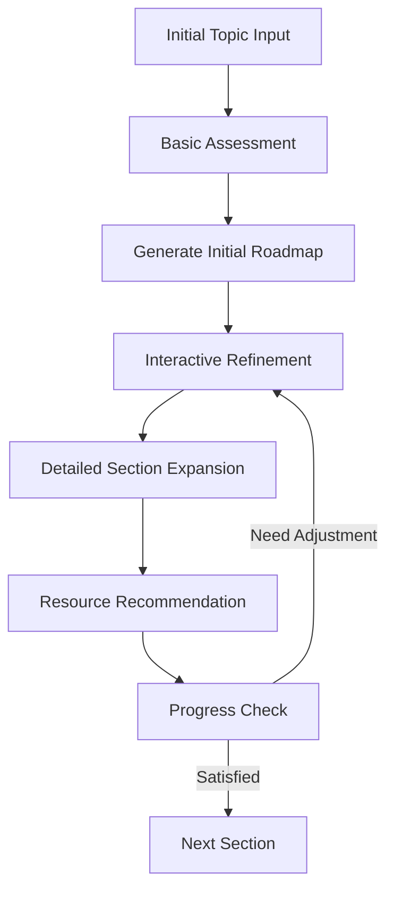

# AI-Powered Interactive Roadmap Generator

## Core Concept Overview

An intelligent system that creates personalized learning roadmaps through interactive conversations,
adapting and refining based on user responses and preferences.

## System Architecture

### 1. Initial Assessment Module

**Trigger Questions:**

```
- What do you want to learn? [Topic]
- What's your current experience level? [Beginner/Intermediate/Advanced]
- What's your target goal? [Specific outcome]
- How much time can you dedicate? [Hours per week]
- Preferred learning style? [Visual/Reading/Practice/Mixed]
- Any specific deadlines? [Timeline]
```

### 2. Roadmap Generation Pipeline

#### Stage 1: Basic Roadmap Creation

```python
initial_prompt_template = """
Create a detailed learning roadmap for {topic} with the following parameters:
- Current level: {level}
- Goal: {goal}
- Available time: {time_commitment}
- Learning style: {learning_style}
- Timeline: {timeline}

Format the roadmap with:
1. Major milestones
2. Prerequisite skills
3. Estimated time for each section
4. Recommended resources
5. Practice projects
"""
```

#### Stage 2: Interactive Refinement Prompts

```python
refinement_prompts = {
    "depth_check": "Would you like more detail about any specific section?",
    "resource_preference": "Do you prefer video tutorials, documentation, or interactive courses?",
    "project_complexity": "Should we adjust the complexity of practice projects?",
    "time_allocation": "Is the time allocation for each section realistic for you?",
    "prerequisite_check": "Do you need additional information about any prerequisites?"
}
```

### 3. Follow-up Question Framework

#### Milestone-Based Questions

1. **Resource Depth**
   ```
   - Would you like more resources for [Milestone X]?
   - Should we break down [Milestone X] into smaller sub-tasks?
   - What specific aspects of [Milestone X] interest you most?
   ```

2. **Progress Tracking**
   ```
   - How comfortable are you with the concepts in [Previous Milestone]?
   - Would you like additional practice exercises for [Topic]?
   - Should we adjust the pace for upcoming sections?
   ```

3. **Practical Application**
   ```
   - Would you like project ideas for [Current Skill]?
   - How can we make [Concept] more relevant to your goals?
   - What type of hands-on practice would be most beneficial?
   ```

## Implementation Features

### 1. Core Features

- Dynamic roadmap generation
- Interactive refinement system
- Progress tracking
- Resource recommendation engine
- Customizable templates
- Export functionality (PDF, MD, Interactive Web)

### 2. Advanced Features

- Spaced repetition reminders
- Project idea generator
- Resource quality verification
- Community feedback integration
- Learning style adaptation
- Progress visualization

### 3. User Experience Flow



## Sample Conversation Flow

1. **Initial Input**
    - User: "I want to learn machine learning"
    - System: [Triggers Assessment Module]

2. **Basic Assessment**
    - System: "What's your current programming experience?"
    - User: "Intermediate Python developer"
    - System: [Adjusts roadmap complexity]

3. **Roadmap Presentation**
    - System: [Generates initial roadmap]
    - System: "Would you like to focus more on any particular area?"

4. **Interactive Refinement**
    - User: "More details on neural networks"
    - System: [Expands neural network section]
    - System: "Should we include practical projects for this section?"

## Technical Implementation

### 1. Backend Structure

```python
class RoadmapGenerator:
    def __init__(self):
        self.user_profile = {}
        self.current_roadmap = {}
        self.conversation_history = []
        
    def generate_initial_roadmap(self, topic, parameters):
        # AI-powered roadmap generation
        pass
        
    def refine_section(self, section_id, feedback):
        # Dynamic section refinement
        pass
        
    def generate_followup_questions(self, context):
        # Context-aware question generation
        pass
```

### 2. AI Integration Points

- Initial roadmap generation
- Follow-up question selection
- Resource recommendation
- Difficulty adjustment
- Progress assessment
- Project suggestion

### 3. Storage Requirements

- User preferences
- Learning progress
- Conversation history
- Generated roadmaps
- Resource database

## Enhancement Ideas

1. **Smart Features**
    - Learning pace prediction
    - Adaptive difficulty
    - Resource quality scoring
    - Progress forecasting
    - Custom project generation

2. **Integration Options**
    - Calendar sync
    - Learning platform APIs
    - Note-taking tools
    - Progress tracking apps
    - Social learning features

3. **Gamification Elements**
    - Achievement system
    - Progress milestones
    - Learning streaks
    - Skill trees
    - Peer challenges
